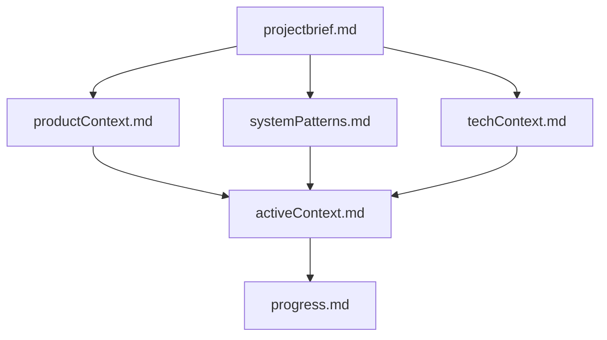

# Claude Code Project Template

> **Branch: `lite`** - Condensed agents with lists of perspectives, patterns, and standards.
> For full agents with verbose code examples, see the `main` branch.

A template for Claude Code projects with the AI Memory Bank system for persistent context across sessions.

## Quick Start

1. **Copy to your project**:
   ```bash
   cp -r claude-template/.claude your-project/
   cp -r claude-template/memory-bank your-project/
   cp claude-template/CLAUDE.md your-project/
   ```

2. **Make scripts executable**:
   ```bash
   chmod +x your-project/.claude/scripts/*.sh
   ```

3. **Configure permissions** (optional):
   ```bash
   cp your-project/.claude/settings.local.json.example your-project/.claude/settings.local.json
   # Edit to uncomment permissions for your stack
   ```

4. **Initialize Memory Bank**:
   ```bash
   cd your-project
   claude
   # Then type: /initialize-memory-bank
   ```

## Structure

```
your-project/
├── .devcontainer/
│   ├── devcontainer.json         # Container config (host networking, tools)
│   └── README.md                 # Dev container documentation
├── .claude/
│   ├── settings.json              # Statusline config (commit this)
│   ├── settings.local.json        # Permissions (gitignore this)
│   ├── skills/
│   │   ├── memory-bank/           # /memory-bank (philosophy + instructions)
│   │   ├── start-session/         # /start-session
│   │   ├── initialize-memory-bank/# /initialize-memory-bank
│   │   ├── update-memory-bank/    # /update-memory-bank
│   │   ├── commit/                # /commit
│   │   ├── open-pr-github/        # /open-pr-github
│   │   ├── release-github/        # /release-github
│   │   ├── ci-status-github/      # /ci-status-github
│   │   ├── open-pr-forgejo/       # /open-pr-forgejo
│   │   ├── release-forgejo/       # /release-forgejo
│   │   └── ci-status-forgejo/     # /ci-status-forgejo
│   ├── agents/
│   │   ├── typescript-writer.md   # Google style, Vue 3, clean architecture
│   │   ├── javascript-writer.md   # ES6+, Vue 3, composables
│   │   ├── php-writer.md          # Laravel, repos/services/actions, OAuth 2.1
│   │   ├── docs-writer.md         # Plain English technical docs
│   │   ├── test-generator.md      # Vitest + Pest test generation
│   │   ├── security-reviewer.md   # OWASP Top 10 review
│   │   └── systems-architect.md   # Right-sized infrastructure decisions
│   ├── hooks/
│   │   ├── format-code.sh.example # Auto-format TS/JS/PHP
│   │   ├── protect-files.sh.example # Block sensitive file edits
│   │   ├── log-commands.sh.example  # Bash command audit log
│   │   └── README.md              # Hook documentation
│   └── scripts/
│       └── statusline-context.sh  # Custom statusline display
├── memory-bank/
│   ├── projectbrief.md            # Foundation - project scope
│   ├── productContext.md          # Why and how it works
│   ├── systemPatterns.md          # Architecture and patterns
│   ├── techContext.md             # Tech stack and setup
│   ├── activeContext.md           # Current work focus
│   └── progress.md                # What works, what's left
└── CLAUDE.md                      # Project instructions + Memory Bank docs
```

## Skills (Commands)

### Memory Bank

| Command | Description |
|---------|-------------|
| `/memory-bank` | **Run first.** Load Memory Bank philosophy and instructions. |
| `/start-session` | **Use at session start.** Loads all Memory Bank context. |
| `/update-memory-bank` | Update Memory Bank after significant changes. |
| `/initialize-memory-bank` | Create Memory Bank structure for new projects. |

### Git Workflow

| Command | Description |
|---------|-------------|
| `/commit` | Create an atomic conventional commit and push. |

### GitHub

| Command | Description |
|---------|-------------|
| `/open-pr-github` | Create a pull request using GitHub CLI. |
| `/release-github` | Create a semantic version release on GitHub. |
| `/ci-status-github` | Check CI/CD pipeline status on GitHub. |

### Forgejo

| Command | Description |
|---------|-------------|
| `/open-pr-forgejo` | Create a pull request via Forgejo REST API. |
| `/release-forgejo` | Trigger semantic version release via Forgejo API. |
| `/ci-status-forgejo` | Check CI/CD pipeline status via Forgejo API. |

## Code Writer Agents (Lite)

Condensed agents focusing on perspectives, patterns, and standards without verbose code examples (~100-130 lines each):

| Agent | Focus |
|-------|-------|
| `typescript-writer` | Google TS style, strict mode, Vue 3, Zod validation |
| `javascript-writer` | ES6+, ESM, Vue 3 composition API, Pinia |
| `php-writer` | PSR-12, Laravel, PHP 8.4, OAuth 2.1 patterns |
| `docs-writer` | Plain English, 7 C's, banned words list |
| `test-generator` | Vitest + Pest, testing pyramid, AAA structure |
| `security-reviewer` | OWASP Top 10, CWE Top 25, CVSS v4.0 |
| `systems-architect` | Right-sized infrastructure, K8s decision framework |

Each agent follows a consistent structure:
- **Perspectives** - Guiding principles
- **Standards** - Rules and conventions
- **Patterns** - Architecture approaches
- **Avoid** - Anti-patterns and red flags

### Using Agents

Agents are invoked automatically when Claude determines the task matches, or explicitly:

```
Write a UserService with repository pattern
→ Uses typescript-writer or php-writer

Generate tests for the AuthController
→ Uses test-generator

Review src/auth/ for security issues
→ Uses security-reviewer
```

## Memory Bank Philosophy

As an AI assistant, my memory resets completely between sessions. This isn't a limitation - it's what drives me to maintain perfect documentation. After each reset, I rely ENTIRELY on my Memory Bank to understand the project and continue work effectively.

### File Hierarchy

Files build upon each other in a clear hierarchy:



### Key Principles

1. **Read ALL files** at session start - this is mandatory, not optional
2. **Update after significant changes** - don't let context drift
3. **Be precise** - vague documentation leads to vague AI responses
4. **Focus on decisions** - document why, not just what

The Memory Bank is my only link to previous work. It must be maintained with precision and clarity, as my effectiveness depends entirely on its accuracy.

## Hooks

Optional automation scripts. See `.claude/hooks/README.md` for details.

| Hook | Purpose |
|------|---------|
| `format-code.sh.example` | Auto-format TS/JS (prettier) and PHP (pint) |
| `protect-files.sh.example` | Block edits to `.env`, secrets, `.git/` |
| `log-commands.sh.example` | Audit trail for Bash commands |

To enable a hook:
```bash
cp .claude/hooks/format-code.sh.example .claude/hooks/format-code.sh
chmod +x .claude/hooks/format-code.sh
```

Then add to `.claude/settings.json` (see hooks README for config).

## Customization

### Add Project-Specific Skills

Create `.claude/skills/your-skill/SKILL.md`:
```markdown
---
name: your-skill
description: What this skill does
---

# Your Skill

Instructions for the AI...
```

### Add Custom Agents

Create `.claude/agents/your-agent.md` following the lite format:
```markdown
---
name: your-agent
description: What this agent does
tools: Read, Grep, Glob, Edit, Write, Bash
model: opus
---

You are a specialized agent that...

## Perspectives
- Guiding principle 1
- Guiding principle 2

## Standards
- Rule 1
- Rule 2

## Patterns
- Pattern 1
- Pattern 2

## Avoid
- Anti-pattern 1
- Anti-pattern 2
```

## Dev Container

This template includes a devcontainer configured for **host network mode**, which is critical for OAuth flows and local development in WSL2 environments.

### Why Host Networking?

```json
"runArgs": ["--network=host"]
```

With host networking, the container shares the host's network stack directly:

| Mode | `localhost:3000` in container | `localhost:3000` on host |
|------|-------------------------------|--------------------------|
| Bridge (default) | Container only | Requires port forwarding |
| **Host** | Same as host | Same as container |

**Benefits:**
- OAuth callbacks work correctly (no forwarding layer to interfere)
- No port mapping confusion between container and host
- Services accessible exactly where you expect them

### Port Forwarding Disabled

With host networking, VS Code's port auto-forwarding is unnecessary and can cause conflicts. This devcontainer disables it completely.

**Note:** Clicking `localhost` links in VS Code terminal may still trigger forwarding. Copy/paste URLs directly into your browser instead.

See `.devcontainer/README.md` for full documentation.

## Git Configuration

Add to `.gitignore`:
```
.claude/settings.local.json
.claude/command-history.log
```

Commit everything else including:
- `.claude/settings.json`
- `.claude/skills/`
- `.claude/agents/`
- `.claude/scripts/`
- `.claude/hooks/*.example`
- `memory-bank/`
- `CLAUDE.md`

## Status Line

The status line shows:
```
Opus | Ctx 42% | Cache 85% | +156/-23
```

- **Model** - Current model in use
- **Ctx %** - Context window usage
- **Cache %** - Cache efficiency (higher = better)
- **+/-** - Lines added/removed this session
